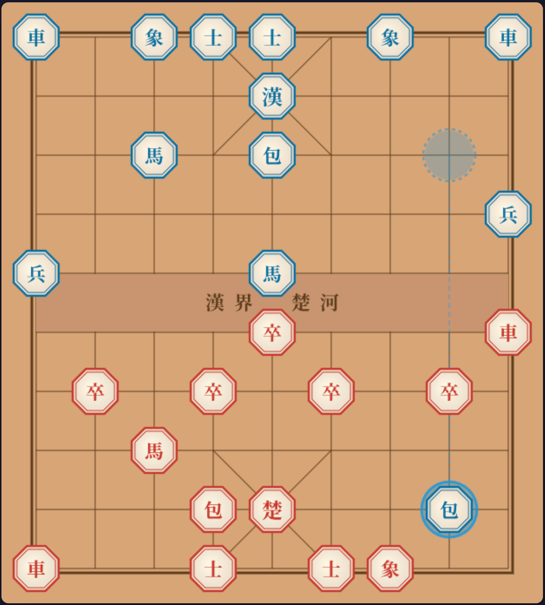

 Janggi Champion AI

Web-based Korean Chess (Janggi) AI with 5-Agent Orchestration Pipeline

Updated: March 4, 2026 | Designer: Brian Lee

---

 Table of Contents

1. [Overview](1-overview)
2. [Architecture](2-architecture)
3. [AI Engine](3-ai-engine)
4. [5-Agent Pipeline](4-5-agent-pipeline)
5. [Memory System](5-memory-system)
6. [Backend API](6-backend-api)
7. [Frontend](7-frontend)
8. [Project Structure](8-project-structure)
9. [Setup & Running](9-setup--running)
10. [API Reference](10-api-reference)
11. [Testing](11-testing)
12. [Configuration](12-configuration)
13. [Technical Details](13-technical-details)

---

 1. Overview

Janggi Champion AI is a full-stack web application for playing Korean Chess (Janggi, 장기) against an AI opponent. The system features:

- A high-performance game engine with advanced search algorithms (Negamax + Alpha-Beta + PVS + Quiescence Search)
- A 5-agent AI orchestration pipeline that analyzes positions from multiple perspectives
- Real-time gameplay via WebSocket with a Canvas-based interactive board
- A 3-layer memory system (Working / Short-term / Long-term) for game context and learning

The AI reaches search depths of 6-7 plies within a 3-second time limit, processing approximately 37,000-39,000 nodes per second.



---

 2. Architecture

```
┌─────────────────────────────────────────────────────────┐
│                    Frontend (Next.js 14)                 │
│  ┌──────────┐  ┌───────────┐  ┌────────────────────┐   │
│  │ JanggiBoard│  │ LeftPanel  │  │    RightPanel       │   │
│  │ (Canvas)  │  │ (Info)    │  │ (AI Analysis)      │   │
│  └──────────┘  └───────────┘  └────────────────────┘   │
│        │              │                  │               │
│  ┌─────┴──────────────┴──────────────────┘               │
│  │     useGame (REST) + useWebSocket (WS)               │
│  └──────────────────────────────────────────────────────│
└────────────────────────┬────────────────────────────────┘
                         │ HTTP + WebSocket
┌────────────────────────┴────────────────────────────────┐
│                  Backend (FastAPI + Uvicorn)              │
│                                                          │
│  ┌──────────────────────────────────────────────────┐   │
│  │              REST API + WebSocket Handler          │   │
│  └───────────────────────┬──────────────────────────┘   │
│                          │                               │
│  ┌───────────────────────┴──────────────────────────┐   │
│  │           JanggiOrchestrator (5-Agent Pipeline)    │   │
│  │                                                    │   │
│  │  ┌─────────┐ ┌─────────┐ ┌─────────┐ ┌────────┐  │   │
│  │  │Strategy │→│UseCase  │→│Win/Loss │→│ Risk   │  │   │
│  │  │Analyst  │ │Designer │ │Analyst  │ │Assessor│  │   │
│  │  └─────────┘ └─────────┘ └─────────┘ └────────┘  │   │
│  │       ↓                                     ↓      │   │
│  │  ┌─────────┐                          ┌────────┐  │   │
│  │  │ Search  │                          │Report  │  │   │
│  │  │ Engine  │                          │Generator│  │   │
│  │  └─────────┘                          └────────┘  │   │
│  └────────────────────────────────────────────────────┘   │
│                                                          │
│  ┌──────────────────────────────────────────────────┐   │
│  │                    Game Engine                     │   │
│  │  Board + Pieces + Evaluator + Search + Game       │   │
│  └──────────────────────────────────────────────────┘   │
│                                                          │
│  ┌──────────────────────────────────────────────────┐   │
│  │              3-Layer Memory System                 │   │
│  │  Working Memory ← Short-Term ← Long-Term (JSON)  │   │
│  └──────────────────────────────────────────────────┘   │
└──────────────────────────────────────────────────────────┘
```

---

 3. AI Engine

 3.1 Board Representation

- Grid: 10 rows x 9 columns (standard Janggi board)
- Pieces: 7 types per team (King, Car/Chariot, Cannon, Horse, Elephant, Guard, Pawn) = 32 total
- Zobrist Hashing: 64-bit incremental hash for fast position identification and transposition table lookups
- Fast Attack Detection: Reverse ray scanning from king position (`_is_square_attacked`) replaces naive all-moves generation for check detection

 3.2 Search Algorithm

The search engine implements multiple advanced techniques layered together:

| Technique | Purpose |
|-----------|---------|
| Negamax | Simplified minimax framework using score negation |
| Alpha-Beta Pruning | Prunes branches that cannot affect the result |
| Principal Variation Search (PVS) | Searches first move with full window, others with zero window |
| Iterative Deepening | Searches progressively deeper (depth 1, 2, 3, ...) within time limit |
| Aspiration Windows | Narrows alpha-beta window based on previous depth's score |
| Transposition Table | Zobrist-keyed cache of evaluated positions (2M entries) |
| Null Move Pruning | Skips a turn to get quick beta cutoffs (R=2 or R=3) |
| Late Move Reductions (LMR) | Reduces search depth for unlikely-good moves |
| Check Extensions | Extends search depth by 1 when giving check |
| Killer Move Heuristic | Remembers moves that caused beta cutoffs at each depth |
| History Heuristic | Scores moves by how often they caused cutoffs in the past |
| Quiescence Search | Extends search at leaf nodes for captures and check escapes |
| Move Validation | Post-search legality check prevents any invalid move from being played |
| Repetition Detection | Returns draw score (0.0) for positions that repeat from game history |
| Opening Book | Pre-computed opening moves for the first 6 moves (중앙졸진, 마진출, 상진출, etc.) |

 3.3 Evaluation Function

Single-pass evaluator iterates the board grid once, computing three components simultaneously:

| Component | Weight (midgame) | Description |
|-----------|-------------------|-------------|
| Material | 1.0 | Piece values with phase adjustments (Cannon value decreases in endgame, Pawn value increases) |
| Position | 0.004 | Pre-computed position score tables for each piece type |
| King Safety | 0.8 | Proximity of attacking pieces to enemy king, defensive pieces around own king |
| Endgame Bonus | (endgame only) | King centralization bonus, pawn advancement bonus for deep penetration |

Piece values: King=0 (infinite), Car=13, Cannon=7, Horse=5, Elephant=3, Guard=3, Pawn=2

Endgame Strategy: In the endgame phase (≤14 pieces), the evaluator adds bonuses for:
- King centralization (center column preferred for active king play)
- Advanced pawns (each row of penetration into enemy territory adds bonus)
- Cannon value decrease (fewer pieces = fewer screens for cannon jumps)
- Pawn value increase (1.5x multiplier as pawns become winning tools)

 3.4 Performance

| Time Limit | Search Depth | Nodes/sec |
|------------|-------------|-----------|
| 0.1s | 3 plies | ~39,000 |
| 0.5s | 5 plies | ~38,000 |
| 1.0s | 6 plies | ~39,000 |
| 2.0s | 6 plies | ~38,000 |
| 3.0s | 7 plies | ~37,000 |

---

 4. 5-Agent Pipeline

The AI uses a Native Sequential Orchestrator pattern with 5 specialized agents:

 Agent 1: Strategy Analyst
- Runs the core search engine to find the best move
- Evaluates board position (material, position, king safety)
- Identifies strategic patterns (opening theory, attacking, defensive)
- Generates candidate moves with scores

 Agent 2: Use Case Designer
- Classifies the current game situation (development, attack, defense, endgame)
- Selects appropriate strategy templates
- Provides tactical recommendations based on position type

 Agent 3: Win/Loss Analyst
- Calculates win probability using sigmoid function on evaluation score
- Tracks evaluation trends across moves
- Determines if position is improving or deteriorating

 Agent 4: Risk Assessor
- Evaluates risk of each candidate move
- Checks for hanging pieces, king exposure, material loss
- Assigns risk grades (A through D)

 Agent 5: Report Generator
- Combines analysis from all agents into a unified dashboard
- Generates human-readable AI thinking summary
- Produces final game reports with phase-by-phase analysis

 Pipeline Flow

```
Human Move → Strategy Analyst → Use Case Designer → Win/Loss Analyst
                                                          ↓
           AI Move ← Report Generator ← Risk Assessor ←──┘
```

Each agent wraps its work in a `BaseAgent.run()` method that provides timing, error handling, and structured output.

---

 5. Memory System

 Working Memory (per-turn, in-memory)
- Current board state, last move, evaluation score
- Recent 3 moves (deque)
- Immediate context for agent decisions

 Short-Term Memory (per-game, in-memory)
- Complete move history with evaluations
- Phase transition records
- Positional trend analysis

 Long-Term Memory (persistent, JSON files)
- Game results and statistics (wins, losses, ELO)
- Strategy patterns database
- Player profiles
- Stored in `data/long_term/` directory

---

 6. Backend API

 Technology Stack
- Framework: FastAPI 0.115.6
- Server: Uvicorn 0.34.0
- Protocol: REST (JSON) + WebSocket
- Language: Python 3.12

 REST Endpoints

| Method | Path | Description |
|--------|------|-------------|
| GET | `/health` | Health check |
| POST | `/api/game/new` | Create new game |
| GET | `/api/game/{id}/state` | Get current game state |
| POST | `/api/game/{id}/move` | Make human move (triggers AI response) |
| POST | `/api/game/{id}/valid-moves` | Get valid moves for a piece |
| GET | `/api/game/{id}/analysis` | Get AI analysis results |
| POST | `/api/game/{id}/undo` | Undo last move pair (human + AI) |
| GET | `/api/game/{id}/report` | Get/finalize game report |
| GET | `/api/stats` | Get global statistics |

 WebSocket Events

| Event | Direction | Description |
|-------|-----------|-------------|
| `game:state_update` | Server -> Client | Board state after each move |
| `game:move` | Client -> Server | Human move submission |
| `game:ai_move` | Server -> Client | AI move with full analysis |
| `game:valid_moves` | Client -> Server | Request valid moves for piece |
| `game:valid_moves_response` | Server -> Client | Valid move list |
| `game:undo` | Client -> Server | Undo request |
| `game:janggun` | Server -> Client | Check notification |
| `game:error` | Server -> Client | Error notification |
| `game:end` | Server -> Client | Game over with final report |

---

 7. Frontend

 Technology Stack
- Framework: Next.js 14.2.21 (Pages Router)
- UI: React 18 + TypeScript
- Board Rendering: HTML5 Canvas API
- Charts: Chart.js + react-chartjs-2

 Components

| Component | File | Description |
|-----------|------|-------------|
| JanggiBoard | `components/JanggiBoard.tsx` | Interactive Canvas board with piece selection, move highlighting, drag support |
| LeftPanel | `components/LeftPanel.tsx` | Player info, turn indicator, agent status LED indicators (Blue=enabled, Red=disabled, Blue+pulse=running), New Game / Undo buttons |
| RightPanel | `components/RightPanel.tsx` | Win probability chart, AI evaluation breakdown, move analysis |

 Hooks

| Hook | File | Description |
|------|------|-------------|
| useGame | `hooks/useGame.ts` | Game state management, REST API calls, move logic |
| useWebSocket | `hooks/useWebSocket.ts` | WebSocket connection, real-time event handling |

 Layout
Three-column layout: Left Panel (player info) | Center (game board) | Right Panel (AI analysis)

---

 8. Project Structure

```
JangGi/
├── backend/
│   ├── main.py                     FastAPI entry point
│   ├── requirements.txt            Python dependencies
│   ├── api/
│   │   ├── routes.py               REST API endpoints
│   │   └── websocket_handler.py    WebSocket event handler
│   ├── agents/
│   │   ├── base_agent.py           Base agent with timing/error handling
│   │   ├── strategy_analyst.py     Agent 1: Search + strategy
│   │   ├── use_case_designer.py    Agent 2: Situation classification
│   │   ├── win_loss_analyst.py     Agent 3: Win probability
│   │   ├── risk_assessor.py        Agent 4: Move risk assessment
│   │   └── report_generator.py     Agent 5: Report generation
│   ├── engine/
│   │   ├── board.py                Board representation + move gen
│   │   ├── pieces.py               Piece types and values
│   │   ├── search.py               Search engine (Negamax + AB + PVS)
│   │   ├── evaluator.py            Position evaluation function
│   │   ├── opening_book.py         Opening book (first 6 moves)
│   │   └── game.py                 Game session management
│   ├── memory/
│   │   ├── memory_manager.py       3-layer memory coordinator
│   │   ├── working_memory.py       Per-turn memory
│   │   ├── short_term_memory.py    Per-game memory
│   │   └── long_term_memory.py     Persistent JSON storage
│   └── orchestrator/
│       └── orchestrator.py         5-agent sequential pipeline
├── frontend/
│   ├── package.json                NPM dependencies
│   ├── tsconfig.json               TypeScript config
│   ├── pages/
│   │   ├── _app.tsx                App wrapper
│   │   ├── _document.tsx           HTML document
│   │   └── index.tsx               Main game page
│   ├── components/
│   │   ├── JanggiBoard.tsx         Canvas board component
│   │   ├── LeftPanel.tsx           Player info panel
│   │   └── RightPanel.tsx          AI analysis panel
│   ├── hooks/
│   │   ├── useGame.ts              Game state hook
│   │   └── useWebSocket.ts         WebSocket hook
│   └── styles/
│       └── globals.css             Global styles
├── tests/
│   ├── test_engine.py              Engine unit tests (8 tests)
│   ├── test_orchestrator.py        Orchestrator tests (5 tests)
│   └── test_ai_diagnostic.py       AI diagnostic + self-play tests
├── data/
│   └── long_term/                  Persistent game data
│       ├── games/                  Game records
│       ├── patterns/               Strategy patterns
│       └── players/                Player profiles
├── docker/
│   ├── Dockerfile.backend          Backend container
│   └── Dockerfile.frontend         Frontend container
├── docker-compose.yml              Docker orchestration
├── run.sh                          Local startup script
├── Self_test_report.md             Test report (41 tests, all pass)
└── README.md                       This file
```

---

 9. Setup & Running

 Prerequisites

- Python 3.12+
- Node.js 18+ and npm
- (Optional) Docker and Docker Compose

 Quick Start

```bash
 Clone and enter project
cd JangGi

 Run everything with one command
chmod +x run.sh
./run.sh
```

This will:
1. Install Python dependencies
2. Install Node.js dependencies
3. Start the frontend dev server on port 3005
4. Start the backend API on port 8001

 Manual Setup

Backend:
```bash
pip3 install -r backend/requirements.txt
python3 -m uvicorn backend.main:app --host 0.0.0.0 --port 8001
```

Frontend:
```bash
cd frontend
npm install
npx next dev -p 3005
```

 Docker

```bash
docker-compose up --build
```

- Backend: http://localhost:8000
- Frontend: http://localhost:3000

 Access Points

| Service | URL |
|---------|-----|
| Frontend | http://localhost:3005 (dev) or http://localhost:3000 (Docker) |
| Backend API | http://localhost:8001 (dev) or http://localhost:8000 (Docker) |
| API Documentation | http://localhost:8001/docs (Swagger UI) |

---

 10. API Reference

 Create Game

```bash
POST /api/game/new
Content-Type: application/json

{
  "cho_formation": "내상외마",     CHO formation (optional)
  "han_formation": "내상외마",     HAN formation (optional)
  "ai_team": "han",              AI plays as "han" or "cho"
  "ai_depth": 6,                 Max search depth (optional)
  "ai_time_limit": 3.0           Search time limit in seconds (optional)
}

 Response: Full game state with game_id
```

 Make Move

```bash
POST /api/game/{game_id}/move
Content-Type: application/json

{
  "from_row": 3,
  "from_col": 0,
  "to_row": 4,
  "to_col": 0
}

 Response: { human_move: {...}, ai_move: {...} }
 AI move includes search stats, evaluation, 5-agent analysis
```

 Get Valid Moves

```bash
POST /api/game/{game_id}/valid-moves
Content-Type: application/json

{ "row": 3, "col": 0 }

 Response: { "valid_moves": [[4,0], [3,1]] }
```

 WebSocket Connection

```javascript
const ws = new WebSocket('ws://localhost:8001/ws/{game_id}');

// Send move
ws.send(JSON.stringify({
  event: 'game:move',
  data: { from_row: 3, from_col: 0, to_row: 4, to_col: 0 }
}));

// Receive AI response
ws.onmessage = (event) => {
  const { event: eventType, data } = JSON.parse(event.data);
  // eventType: 'game:ai_move', 'game:state_update', etc.
};
```

---

 11. Testing

 Run All Tests

```bash
 Unit tests
python3 -m pytest tests/test_engine.py tests/test_orchestrator.py -v

 AI diagnostic tests (includes self-play)
python3 -m tests.test_ai_diagnostic
```

 Test Coverage

| Suite | Tests | Description |
|-------|-------|-------------|
| `test_engine.py` | 8 | Board, pieces, moves, evaluator, search, game, check |
| `test_orchestrator.py` | 5 | Game creation, pipeline, analysis, valid moves, stats |
| `test_ai_diagnostic.py` | 8 | Eval symmetry, search symmetry, hash, tactics, perf, move validity |

 Self-Test Report

See [Self_test_report.md](Self_test_report.md) for the complete test report with 41 tests covering:
- Self-play simulations (120 moves, 0 invalid moves, 0 corruptions)
- All REST API endpoints (24 tests including error cases)
- WebSocket integration
- Frontend build verification
- Framework code review

---

 12. Configuration

 Environment Variables

| Variable | Default | Description |
|----------|---------|-------------|
| `AI_DEPTH` | 6 | Maximum search depth |
| `AI_TIME_LIMIT` | 3.0 | Search time limit (seconds) |
| `STORAGE_DIR` | `./data/long_term` | Long-term memory storage path |

 Piece Values

| Piece | Korean | Hanja | Value |
|-------|--------|-------|-------|
| King | 왕 | 漢/楚 | 0 (infinite) |
| Car (Chariot) | 차 | 車 | 13 |
| Cannon | 포 | 包 | 7 |
| Horse | 마 | 馬 | 5 |
| Elephant | 상 | 象 | 3 |
| Guard | 사 | 士 | 3 |
| Pawn | 졸/병 | 卒/兵 | 2 |

 Board Coordinates

```
     0   1   2   3   4   5   6   7   8
  0  車  馬  象  士  楚  士  象  馬  車    ← CHO (row 0-4)
  1  ·   ·   ·   ·   ·   ·   ·   ·   ·
  2  ·   包  ·   ·   ·   ·   ·   包  ·
  3  卒  ·   卒  ·   卒  ·   卒  ·   卒
  4  ·   ·   ·   ·   ·   ·   ·   ·   ·
  5  ·   ·   ·   ·   ·   ·   ·   ·   ·
  6  兵  ·   兵  ·   兵  ·   兵  ·   兵
  7  ·   包  ·   ·   ·   ·   ·   包  ·
  8  ·   ·   ·   ·   ·   ·   ·   ·   ·
  9  車  馬  象  士  漢  士  象  馬  車    ← HAN (row 5-9)
```

---

 13. Technical Details

 Critical Bug Fixes (Session 3, March 2026)

1. `undo_move` Piece Swap Bug: The move history stored captured pieces as dict snapshots, causing wrong piece restoration when multiple same-type pieces were captured at the same position. Fixed by storing direct object references.

2. SearchTimeout Board Corruption: When `SearchTimeout` exception propagated through recursive search, `undo_move()` was never called. Fixed with `try/finally` around all `move_piece`/`undo_move` pairs.

3. Quiescence Infinite Recursion: The in-check branch of quiescence search had no depth limit, causing `RecursionError` during perpetual check. Fixed with depth bound.

4. `is_in_check` Performance: Replaced O(all_enemy_moves) check detection with O(ray_scan) reverse attack detection, reducing `is_in_check` from 66% of search time to <20%.

 Key Design Decisions

- Single-pass Evaluation: Material, position, and king safety computed in one grid iteration for maximum speed at leaf nodes
- `__slots__` Pieces: Piece class uses `__slots__` with cached `_value`, `_hanja` for zero-overhead property access
- Tuple Move History: Move history uses lightweight tuples `(fr, fc, tr, tc, captured_ref)` instead of dicts for search performance
- Canvas Rendering: Frontend uses HTML5 Canvas instead of React-Konva for a lighter footprint
- Sequential Pipeline: 5 agents run sequentially (not parallel) to ensure each agent has access to previous agents' results
- Agent LED Indicators: Each AI agent has a LED-style status indicator with glow effects — Red LED (disabled/error), Blue LED (enabled/success), Blue LED with pulse animation (currently running)

---

Janggi Champion AI - Korean Chess AI System
Built with Python, FastAPI, Next.js, React, and TypeScript
